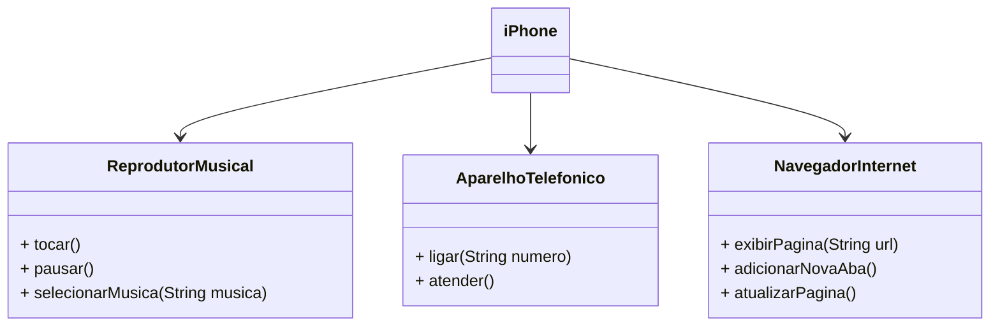

# DESAFIO - POO + UML

## Autor e descrição do desafio
- Autor: [Gleyson Sampaio](https://github.com/glysns)
- Descrição: [Link](https://github.com/digitalinnovationone/trilha-java-basico/blob/main/desafios/poo/README.md)

## Resolução UML

### UML (Mermaid)

Acesse os arquivos .java para conhecer a implementação das classes que resolvem o desafio.
